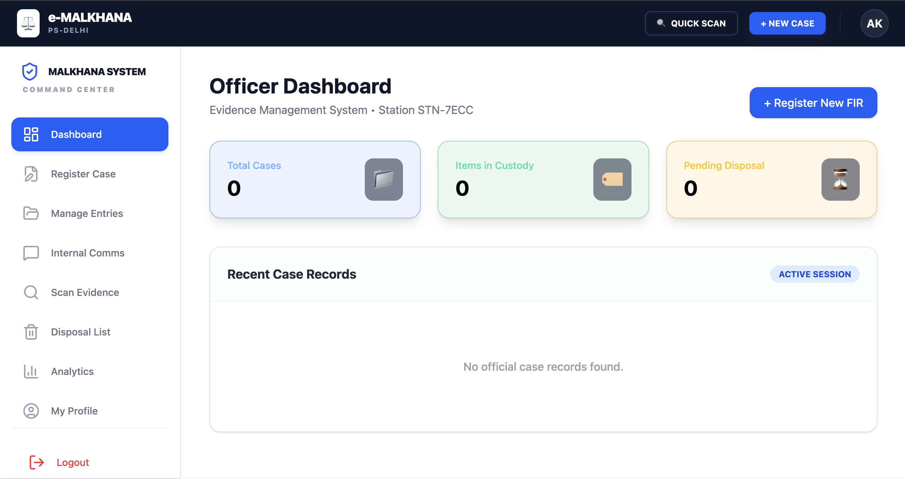
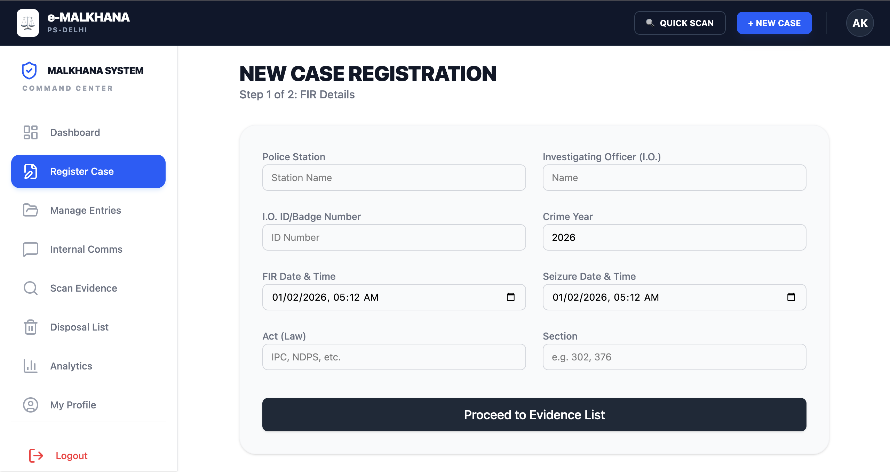
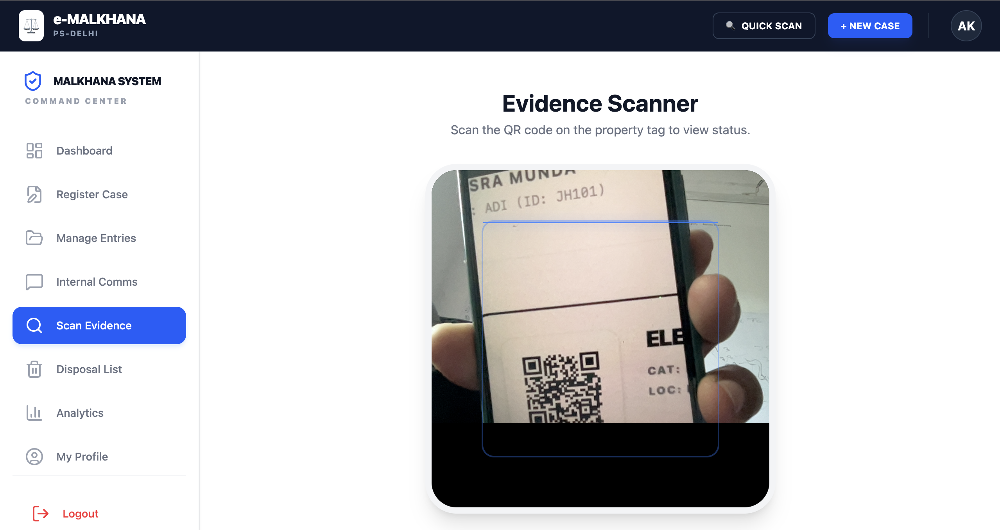
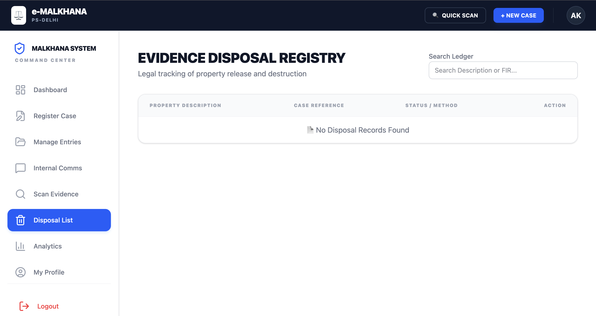
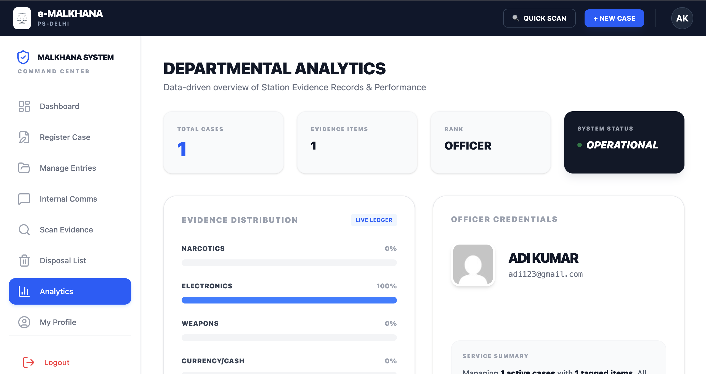
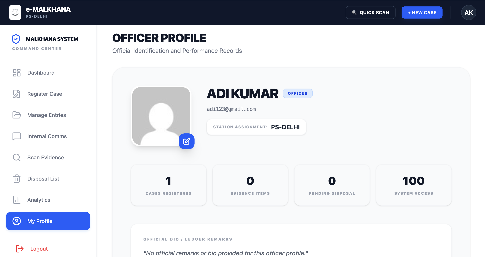

# 📁 Digital-e-Malkhana: Police Evidence Management

**Digital-e-Malkhana** is a high-security, internal-facing platform designed to modernize police evidence management and secure officer communications. It replaces traditional paper-based ledgers with a high-performance "Terminal" interface, ensuring transparency, auditability, and data security.

---
   
## 🖥️ System Overview

### Officer Dashboard
The central command hub provides a real-time overview of case metrics, items in custody, and pending disposal actions.


---

## 🚀 Key Features

### 1. Evidence Management (Malkhana Module)
* **Digital Case Registration:** Register First Information Reports (FIR) with specific legal acts, sections, and investigating officer details.


* **Evidence Scanner:** Integrated QR-code scanning to instantly verify property tags and view real-time status.


* **Disposal Registry:** Legal tracking of property release, destruction, or judicial orders to maintain a clean chain of custody.


### 2. Departmental Analytics
Gain a data-driven overview of station performance, evidence distribution (Narcotics, Weapons, Electronics), and system operational status.


### 3. Officer Identity & Records
Digitalized officer profiles manage official identification, station assignments, and individual performance benchmarks.


---

## 🛠️ Tech Stack

* **Frontend:** React.js, Tailwind CSS (Terminal UI), Lucide Icons
* **Backend:** Node.js, Express.js, Socket.io (WebSockets)
* **Database:** PostgreSQL with Prisma ORM
* **Authentication:** JWT (JSON Web Tokens)

---

## 🔧 Setup and Installation

### 1. Clone the Repository
```bash
git clone [https://github.com/aditya1006gt/Digital-e-Malkhana-for-Police-Evidence-Management](https://github.com/aditya1006gt/Digital-e-Malkhana-for-Police-Evidence-Management)
cd Digital-e-Malkhana-for-Police-Evidence-Management

# 🔧 Setup and Installation

### 1. Backend Setup
```bash
cd backend
npm install
# Configure .env with DATABASE_URL and JWT_SECRET
npx prisma migrate dev
mpx prisma generate
tsc -b && node dist/index.js

# 🔧 Frontend Configuration

### 1. Development Setup
```bash
cd frontend
npm install
npm run dev